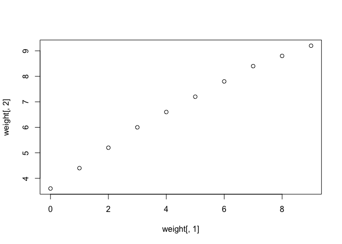
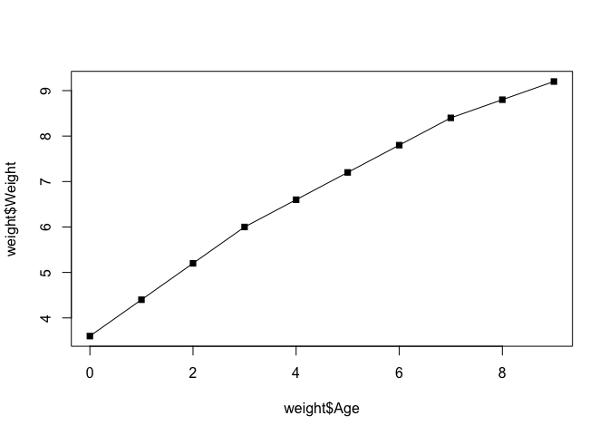
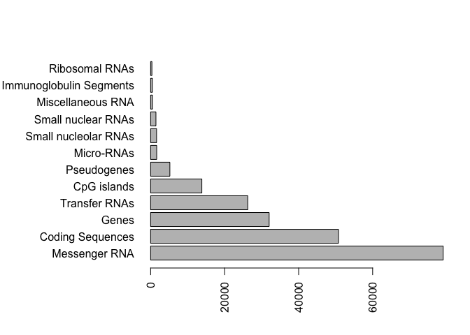
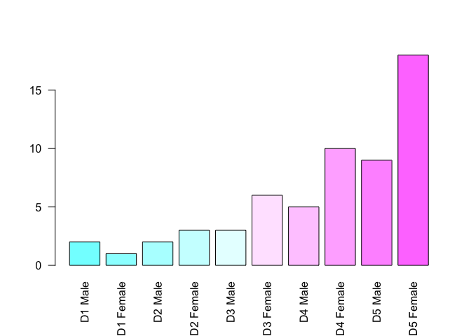
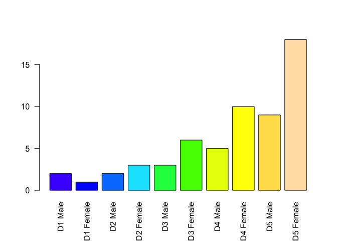
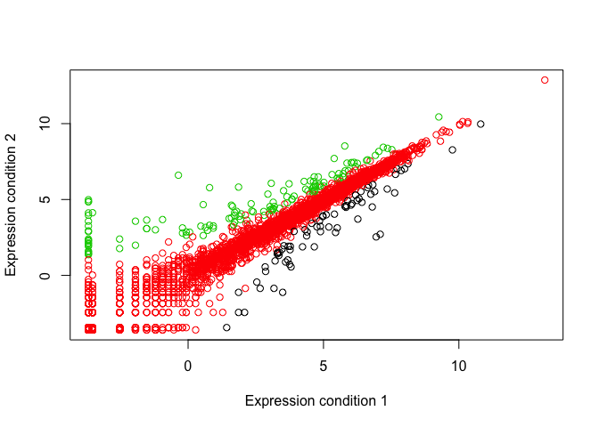
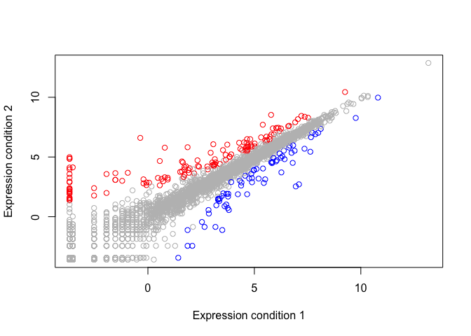

Class5 R graphics
================
Barry
Fri Jan 25 13:30:02 2019

Class 05 Graphics and plots with R This is some narative text that I can style **bold** and *italic* and add links to [webpages](https://rmarkdown.rstudio.com/articles_report_from_r_script.html)

``` r
# Section 2A: line plot

weight <- read.table("bimm143_05_rstats/weight_chart.txt", header=TRUE)

plot(weight[,1], weight[,2])
```



``` r
plot(weight$Age, weight$Weight, pch=15, type="o" )
```



``` r
# 2B Barplot

feat <- read.table("bimm143_05_rstats/feature_counts.txt", header=TRUE, sep="\t")

barplot(feat$Count, names.arg = feat$Feature, las=2, horiz=TRUE)

old.mar <- par()$mar

par(mar=c(5, 11, 4, 2))
barplot(feat$Count, names.arg = feat$Feature, las=2, horiz=TRUE)
```



``` r
# More custom arguments
par(mar=c(3.1, 11.1, 4.1, 2))
barplot(feat$Count, names.arg=feat$Feature, 
        horiz=TRUE, ylab="", 
        main="Number of features in the mouse GRCm38 genome", 
        las=1, xlim=c(0,80000))
```


``` r
par(mar=old.mar)

# Section 3

mf <- read.table("bimm143_05_rstats/male_female_counts.txt", header=TRUE, sep="\t")

barplot(mf$Count, names.arg = mf$Sample, las=2, col=rainbow( nrow(mf) ))
```


``` r
barplot(mf$Count, names.arg = mf$Sample, las=2, col=cm.colors( nrow(mf) ))
```



``` r
barplot(mf$Count, names.arg = mf$Sample, las=2, col=topo.colors( nrow(mf) ))
```



``` r
# Section 3B RNA-Seq data

exp <- read.delim("bimm143_05_rstats/up_down_expression.txt")

# how many genes
nrow(exp)
```

    ## [1] 5196

``` r
table(exp$State)
```

    ## 
    ##       down unchanging         up 
    ##         72       4997        127

``` r
plot(exp$Condition1, exp$Condition2, col=exp$State, 
     xlab="Expression condition 1", ylab="Expression condition 2")
```



``` r
old.pal <- palette()
palette(c("blue","gray","red"))
plot(exp$Condition1, exp$Condition2, 
     col=exp$State, xlab="Expression condition 1", ylab="Expression condition 2")
```



``` r
palette(old.pal)


#View(exp)
```
